## Portfolio

---

### Deep learning time series forecasting - Türkiye energy consumption data (April 2024)
[Link to report](https://github.com/AhmetZamanis/DeepLearningEnergyForecasting/blob/main/Report.md), [Link to GitHub repository](https://github.com/AhmetZamanis/DeepLearningEnergyForecasting)
\
Multi-horizon time series forecasting on a large dataset of hourly energy consumption values. Implementing a stateful LSTM model and an Inverted Transformer model using PyTorch Lightning, drawing inspiration from multiple existing architectures & making some modifications. Tuning hyperparameters with Optuna, generating forecast intervals with quantile regression, visualizing & comparing predictive performances.
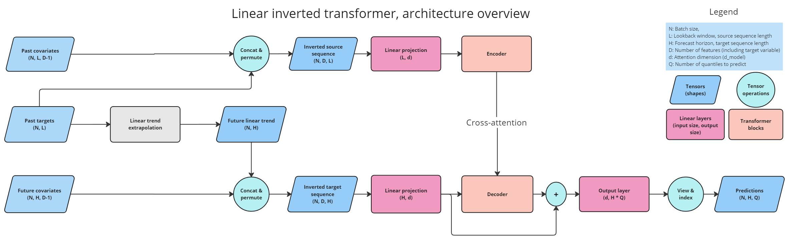

---

### Time series classification - Canadian weather data (August 2023)
[Link to report](https://github.com/AhmetZamanis/WeatherAnomalyDetectionClassification/blob/main/ReportClassification.md), [Link to GitHub repository](https://github.com/AhmetZamanis/WeatherAnomalyDetectionClassification)
\
Multivariate time series classification using sktime and pyts: kNN with DTW distance, ROCKET & Arsenal, WEASELMUSE and a PyTorch Lightning convolutional neural network trained on image transformed data. Visualizing & comparing the performances of all algorithms.
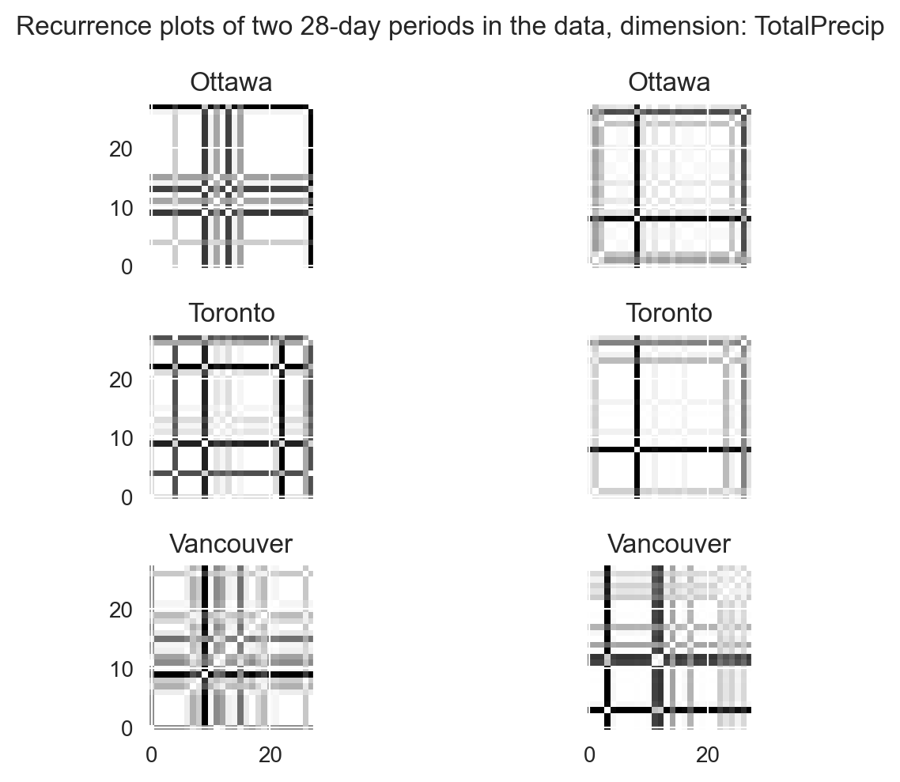

---

### Time series anomaly detection - Canadian weather data (August 2023)
[Link to report](https://ahmetzamanis.github.io/WeatherAnomalyDetectionClassification/), [Link to GitHub repository](https://github.com/AhmetZamanis/WeatherAnomalyDetectionClassification)
\
Multivariate time series anomaly detection using PyOD algorithms & the Darts package: K-means clustering, Gaussian Mixture Models, ECOD, Isolation Forest and an Autoencoder with PyTorchLightning. Visualizing & comparing the results with multiple plots, including 3D interactive Plotly scatterplots.
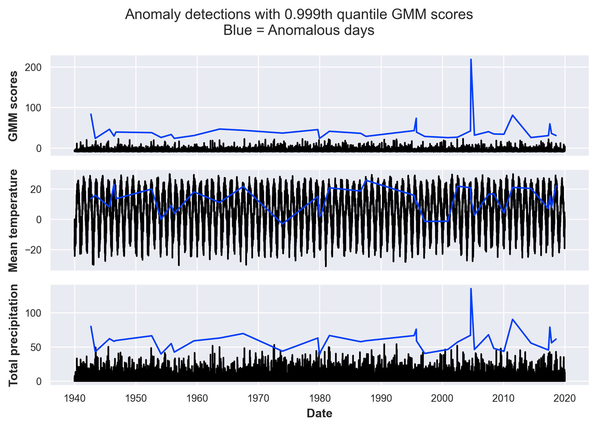

---

### Deep learning imbalanced classification - Used cars "kicks" problem (May 2023)
[Link to report](https://github.com/AhmetZamanis/UsedCarKicksClassification/blob/main/Report.md), [Link to GitHub repository](https://github.com/AhmetZamanis/UsedCarKicksClassification)
\
Imbalanced binary classification with scikit-learn and PyTorch Lightning, on a large dataset of used cars. Comparing logistic regression, SVM and XGBoost trained with class weights, with a neural network trained with focal loss. Performing hyperparameter optimization with Optuna. Assessing model performances with classification metrics & a sensitivity analysis based on a business scenario.
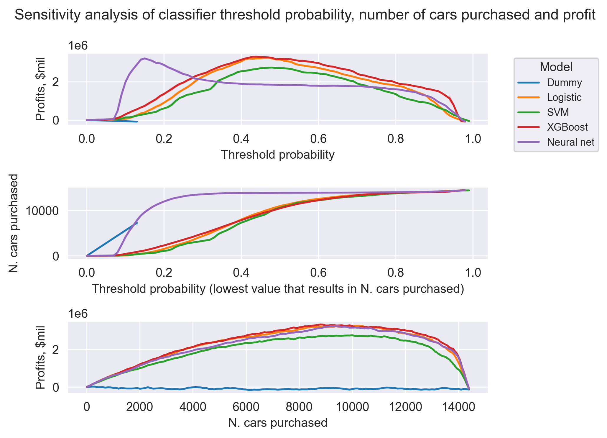

---

### Time series regression - Store sales forecasting Kaggle competition (March 2023)
[Link to report, part 1](https://github.com/AhmetZamanis/KaggleStoreSales/blob/main/ReportPart1.md)
\ 
[Link to report, part 2](https://github.com/AhmetZamanis/KaggleStoreSales/blob/main/ReportPart2.md)
\ 
[Link to GitHub repository](https://github.com/AhmetZamanis/KaggleStoreSales/)
\ 
[Link to Kaggle notebook](https://www.kaggle.com/code/ahmetzamanis/store-sales-autoets-with-darts)
\
Time series regression modeling on a dataset of supermarket sales across years, with the Darts library in Python. Performing time decomposition & hybrid modeling, trying statistical methods such as linear regression, AutoARIMA and STL, as well as time series forecasting global neural networks / deep learning models.
Best score: 0.42505 RMSLE, placing 61th out of 612 (top 10%) in the leaderboard at submission time (March 2023).
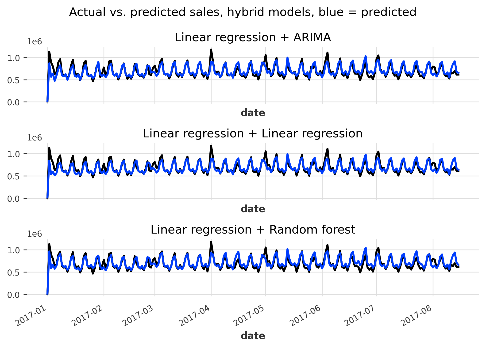

---

### Kaggle Competition - House Prices Regression (2022)
[Link to report](https://github.com/AhmetZamanis/Kaggle-House-Prices-Regression-FeatureEng/blob/main/HousePricesReport.md), [Link to GitHub repository](https://github.com/AhmetZamanis/Kaggle-House-Prices-Regression-FeatureEng)
\
Feature engineering, MRMR feature selection and XGBoost modeling for the Kaggle House Prices Regression competition. Best submission score (September 2022): 0.12143 RMSLE, 271th place, top 8%.
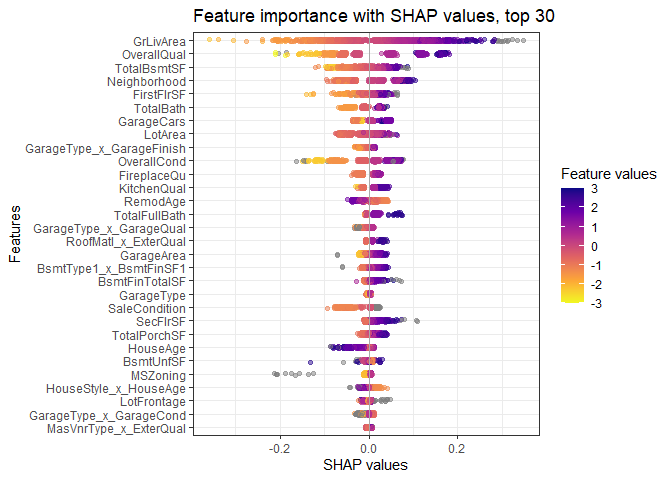

---

### Imbalanced classification - Loan requests analysis (2022)
[Link to report](https://github.com/AhmetZamanis/LoanRequestClassification/blob/main/Report.md), [Link to GitHub repository](https://github.com/AhmetZamanis/LoanRequestClassification)
\
Imbalanced classification modeling with loan requests dataset. Hyperparameter tuning, performance benchmarking and performance metrics interpretation with the mlr3 package in R.
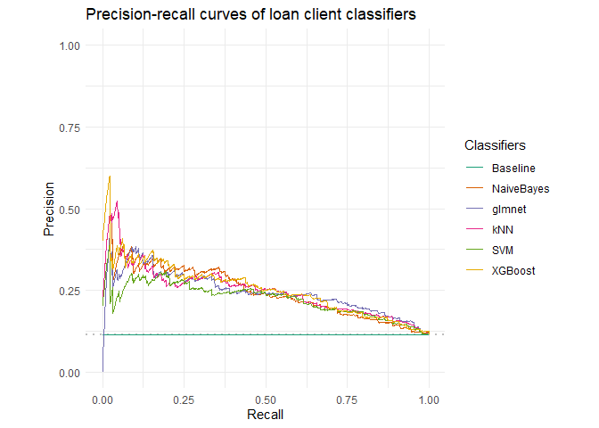

---

### Generalized Additive Models - Concrete Strength Analysis (2022)
[Link to report](https://ahmetzamanis.github.io/ConcreteStrengthGAM/), [Link to GitHub repository](https://github.com/AhmetZamanis/ConcreteStrengthGAM)
\
Predicting concrete compressive strength using GAM regression, as a non-linear function of the mixture components. Visualization of the results with 3D interactive Plotly plots.
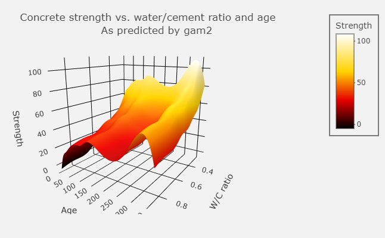

---

### Bayesian Linear Regression - Used car prices analysis (2022)
[Link to report](https://github.com/AhmetZamanis/BayesianUsedCars/blob/main/BayesianUsedCarsGit.md), [Link to GitHub repository](https://github.com/AhmetZamanis/BayesianUsedCars)
\
Predicting used car prices using Bayesian Linear Regression, visualizing results and comparing with OLS regression.
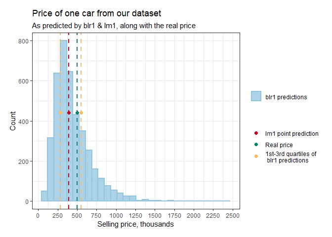

---

### Clustering analysis - Country statistics (2022)
[Link to report](https://github.com/AhmetZamanis/ClusteringCountry/blob/main/ClusteringCountry2.md), [Link to GitHub repository](https://github.com/AhmetZamanis/ClusteringCountry)
\
Non-hierarchical k-medoids clustering on a dataset of country statistics.
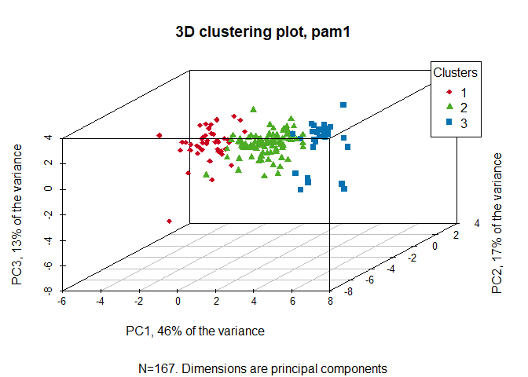

---

### Classification - Airline satisfaction analysis (2022)
[Link to report](https://github.com/AhmetZamanis/AirlineClassification/blob/main/ClassificationAirline2.md), [Link to GitHub repository](https://github.com/AhmetZamanis/AirlineClassification)
\
Classification modeling on a large dataset of airline passenger satisfaction, using logistic regression, decision trees and random forests.
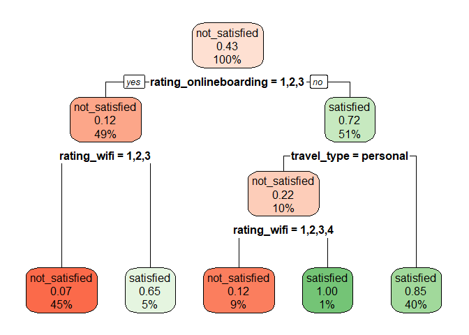

---

---

Page template forked from <a href="https://github.com/evanca/quick-portfolio">evanca</a>

<!-- Remove above link if you don't want to attibute -->
